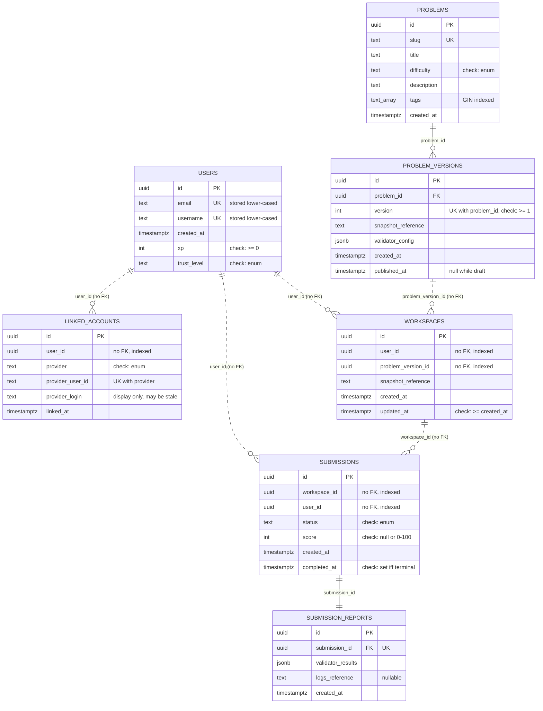

# Database Schema

The Phase 1 schema. Structure and reasoning are decided in
[ADR 0004](adr/0004-persistence-and-migrations.md); this document is the map.

One PostgreSQL database, one schema per module. A module's `DbContext` maps only its own tables, so
a module cannot reach another module's data through EF at all.

| Schema | Owner module | Tables |
| --- | --- | --- |
| `users` | Users | `users` |
| `auth` | Auth | `linked_accounts` |
| `problems` | Problems | `problems`, `problem_versions` |
| `workspaces` | Workspaces | `workspaces` |
| `submissions` | Submissions | `submissions`, `submission_reports` |

Each schema also holds its own `__migrations_history`, so module migrations are independent.

## Entity relationships

Solid lines are real foreign keys. Dashed lines are references that carry **no** constraint,
because they cross a module boundary — see [Cross-module references](#cross-module-references).



## Conventions

**Identifiers** are UUID v7, generated by the application. Version 7 is time-ordered, so inserts
land at the right-hand edge of the primary key index instead of scattering across it the way v4
does. Clients treat them as opaque strings ([ADR 0003](adr/0003-api-conventions.md)).

**Names** are `snake_case`, applied by `EFCore.NamingConventions`. The schema is read and queried by
hand in `psql` as often as by the application, so it follows PostgreSQL convention rather than C#.

**Timestamps** are `timestamptz`, always UTC, mapped from `DateTimeOffset`.

**Enums** are stored as text, not integers, so a row is legible without a lookup table, and every
enum column carries a check constraint listing the allowed values. Text alone would accept anything.

**JSON** columns are `jsonb`, not `text`: PostgreSQL validates them on write, and they can be
queried directly when diagnosing an evaluation.

## Cross-module references

`workspaces.user_id` points at a row in `users.users`, but there is no `FOREIGN KEY`. Constraints
across schemas would reinstate exactly the coupling the schema split removes. The five unconstrained
references are:

| Column | Points at | Validated by |
| --- | --- | --- |
| `auth.linked_accounts.user_id` | `users.users.id` | Auth module on link |
| `workspaces.workspaces.user_id` | `users.users.id` | Workspaces module on create |
| `workspaces.workspaces.problem_version_id` | `problems.problem_versions.id` | Workspaces module on create |
| `submissions.submissions.workspace_id` | `workspaces.workspaces.id` | Submissions module on create |
| `submissions.submissions.user_id` | `users.users.id` | Submissions module on create |

What this costs, and what pays for it:

- Orphan rows become possible if a delete races a write. Cleanup is
  [#43](https://github.com/shoraLBRT/ritocode/issues/43); user deletion must notify each module
  rather than run a single `DELETE`.
- Every one of these columns is explicitly indexed, since without a constraint it inherits nothing.
- Cross-module joins are impossible in SQL. A screen needing data from two modules composes it in
  the API layer. If that becomes a performance problem, the answer is a read model owned by one
  module, not a cross-schema join.

## Invariants the database enforces

Application code can enforce these too, but a worker crashing mid-transition is exactly how such
rules rot, so they live in the schema:

| Constraint | Rule |
| --- | --- |
| `ck_users_xp_not_negative` | `xp >= 0` |
| `ck_problem_versions_version_positive` | `version >= 1` |
| `ck_workspaces_updated_not_before_created` | `updated_at >= created_at` |
| `ck_submissions_score_range` | `score` is null or between 0 and 100 |
| `ck_submissions_completed_at_matches_status` | `completed_at` is set exactly when status is terminal |
| `ck_*_<enum column>` | the column holds a value from its enum |

## Indexes that exist for a specific query

Beyond primary keys and uniqueness:

| Index | Serves |
| --- | --- |
| `problems (tags)` GIN | catalog filtering by tag, `tags @> ARRAY['refactoring']` |
| `problem_versions (problem_id, published_at)` partial | resolving the current version of a problem; drafts are never resolved, so they are excluded |
| `workspaces (user_id, updated_at DESC)` | "continue where you left off" |
| `submissions (user_id, created_at DESC)` | attempt history, newest first |
| `submissions (status, created_at)` partial | the queue drain; stays the size of the backlog rather than of all history |

## Working with the schema

```bash
./scripts/dev-up.sh
```

Adds a migration to one module:

```bash
pwsh ./scripts/db-migrations-add.ps1 -Module Problems -Name AddProblemLanguage
```

Applies pending migrations:

```bash
dotnet run --project src/Ritocode.DbMigrator
```

Reports pending migrations without applying them — exits 2 when any exist:

```bash
dotnet run --project src/Ritocode.DbMigrator -- status
```

Fails when a module's model no longer matches its last migration:

```bash
./scripts/db-verify-no-drift.sh
```
