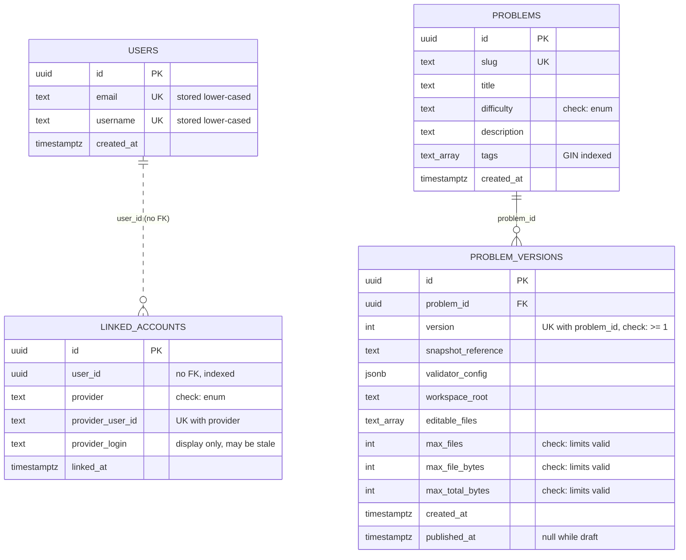

# Database Schema

The schema as it exists. Structure and reasoning are decided in
[ADR 0004](adr/0004-persistence-and-migrations.md); this document is the map.

One PostgreSQL database, one schema per module. A module's `DbContext` maps only its own tables, so
a module cannot reach another module's data through EF at all.

| Schema | Owner module | Tables |
| --- | --- | --- |
| `users` | Users | `users` |
| `auth` | Auth | `linked_accounts` |
| `problems` | Problems | `problems`, `problem_versions` |

Each schema also holds its own `__migrations_history`, so module migrations are independent.

> **The `problems` schema belongs to the previous product** and is replaced by the Content schema of
> [#121](https://github.com/shoraLBRT/ritocode/issues/121). The Workspaces and Submissions schemas
> were removed in [#119](https://github.com/shoraLBRT/ritocode/issues/119); no production database
> ever held them, so development databases are recreated rather than migrated.

## Entity relationships

Solid lines are real foreign keys. Dashed lines are references that carry **no** constraint,
because they cross a module boundary — see [Cross-module references](#cross-module-references).


```mermaid
erDiagram
    USERS ||..o{ LINKED_ACCOUNTS : "user_id (no FK)"
    PROBLEMS ||--o{ PROBLEM_VERSIONS : "problem_id"

    USERS {
        uuid id PK
        text email UK "stored lower-cased"
        text username UK "stored lower-cased"
        timestamptz created_at
    }

    LINKED_ACCOUNTS {
        uuid id PK
        uuid user_id "no FK, indexed"
        text provider "check: enum"
        text provider_user_id "UK with provider"
        text provider_login "display only, may be stale"
        timestamptz linked_at
    }

    PROBLEMS {
        uuid id PK
        text slug UK
        text title
        text difficulty "check: enum"
        text description
        text_array tags "GIN indexed"
        timestamptz created_at
    }

    PROBLEM_VERSIONS {
        uuid id PK
        uuid problem_id FK
        int version "UK with problem_id, check: >= 1"
        text snapshot_reference
        jsonb validator_config
        text workspace_root
        text_array editable_files
        int max_files "check: limits valid"
        int max_file_bytes "check: limits valid"
        int max_total_bytes "check: limits valid"
        timestamptz created_at
        timestamptz published_at "null while draft"
    }
```

## Conventions

**Identifiers** are UUID v7, generated by the application. Version 7 is time-ordered, so inserts
land at the right-hand edge of the primary key index instead of scattering across it the way v4
does. Clients treat them as opaque strings ([ADR 0003](adr/0003-api-conventions.md)).

**Names** are `snake_case`, applied by `EFCore.NamingConventions`. The schema is read and queried by
hand in `psql` as often as by the application, so it follows PostgreSQL convention rather than C#.

**Timestamps** are `timestamptz`, always UTC, mapped from `DateTimeOffset`.

**Enums** are stored as text, not integers, so a row is legible without a lookup table, and every
enum column carries a check constraint listing the allowed values. Text alone would accept anything.

**JSON** columns are `jsonb`, not `text`: PostgreSQL validates them on write, and they can be
queried directly when diagnosing a problem.

## Cross-module references

`linked_accounts.user_id` points at a row in `users.users`, but there is no `FOREIGN KEY`.
Constraints across schemas would reinstate exactly the coupling the schema split removes.

| Column | Points at | Validated by |
| --- | --- | --- |
| `auth.linked_accounts.user_id` | `users.users.id` | Auth module on link |

"Validated by" means through a contract in `Ritocode.Shared/Contracts` — here `IUserLookup` — never
by opening the owning module's `DbContext` ([ADR 0007](adr/0007-cross-module-contract-form.md)).
`linked_accounts.user_id` gets its first writer with sign-in,
[#7](https://github.com/shoraLBRT/ritocode/issues/7).

What this costs, and what pays for it:

- Orphan rows become possible if a delete races a write; user deletion must notify each module
  rather than run a single `DELETE`.
- Every such column is explicitly indexed, since without a constraint it inherits nothing.
- Cross-module joins are impossible in SQL. A screen needing data from two modules composes it in
  the API layer. If that becomes a performance problem, the answer is a read model owned by one
  module, not a cross-schema join.

## Invariants the database enforces

| Constraint | Rule |
| --- | --- |
| `ck_problem_versions_version_positive` | `version >= 1` |
| `ck_problem_versions_limits_valid` | `max_files >= 1`, `max_file_bytes >= 1`, and `max_total_bytes >= max_file_bytes` |
| `ck_*_<enum column>` | the column holds a value from its enum |

## Indexes that exist for a specific query

Beyond primary keys and uniqueness:

| Index | Serves |
| --- | --- |
| `problems (tags)` GIN | catalog filtering by tag |
| `problem_versions (problem_id, published_at)` partial | resolving the current version of a problem; drafts are excluded |

## Working with the schema

```bash
./scripts/dev-up.sh
```

Adds a migration to one module:

```bash
pwsh ./scripts/db-migrations-add.ps1 -Module Users -Name AddDisplayName
```

Applies pending migrations:

```bash
dotnet run --project src/Ritocode.DbMigrator
```

Reports pending migrations without applying them — exits 2 when any exist:

```bash
dotnet run --project src/Ritocode.DbMigrator -- status
```

Fails when a module's model no longer matches its last migration:

```bash
./scripts/db-verify-no-drift.sh
```
