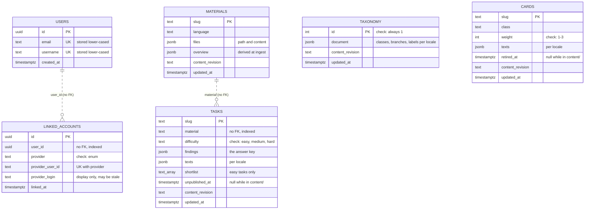

# Database Schema

The schema as it exists. Structure and reasoning are decided in
[ADR 0004](adr/0004-persistence-and-migrations.md); this document is the map.

One PostgreSQL database, one schema per module. A module's `DbContext` maps only its own tables, so
a module cannot reach another module's data through EF at all.

| Schema | Owner module | Tables |
| --- | --- | --- |
| `users` | Users | `users` |
| `auth` | Auth | `linked_accounts` |
| `content` | Content | `taxonomy`, `cards`, `materials`, `tasks` |

Each schema also holds its own `__migrations_history`, so module migrations are independent.

> The `problems`, `workspaces` and `submissions` schemas of the previous product were removed in
> [#119](https://github.com/shoraLBRT/ritocode/issues/119) and
> [#121](https://github.com/shoraLBRT/ritocode/issues/121). No production database ever held them,
> and no migration drops them: a development database is recreated (`docker compose down -v`).

## Entity relationships

Solid lines are real foreign keys. Dashed lines are references that carry **no** constraint.


```mermaid
erDiagram
    USERS ||..o{ LINKED_ACCOUNTS : "user_id (no FK)"
    MATERIALS ||..o{ TASKS : "material (no FK)"

    USERS {
        uuid id PK
        text email UK "stored lower-cased"
        text username UK "stored lower-cased"
        timestamptz created_at
    }

    LINKED_ACCOUNTS {
        uuid id PK
        uuid user_id "no FK, indexed"
        text provider "check: enum"
        text provider_user_id "UK with provider"
        text provider_login "display only, may be stale"
        timestamptz linked_at
    }

    TAXONOMY {
        int id PK "check: always 1"
        jsonb document "classes, branches, labels per locale"
        text content_revision
        timestamptz updated_at
    }

    CARDS {
        text slug PK
        text class
        int weight "check: 1-3"
        jsonb texts "per locale"
        timestamptz retired_at "null while in content/"
        text content_revision
        timestamptz updated_at
    }

    MATERIALS {
        text slug PK
        text language
        jsonb files "path and content"
        jsonb overview "derived at ingest"
        text content_revision
        timestamptz updated_at
    }

    TASKS {
        text slug PK
        text material "no FK, indexed"
        text difficulty "check: easy, medium, hard"
        jsonb findings "the answer key"
        jsonb texts "per locale"
        text_array shortlist "easy tasks only"
        timestamptz unpublished_at "null while in content/"
        text content_revision
        timestamptz updated_at
    }
```

## Conventions

**Identifiers** are UUID v7, generated by the application — except content, which is keyed by its
**slug**: permanent, human-readable, and what attempts and URLs name. Clients treat ids as opaque
strings ([ADR 0003](adr/0003-api-conventions.md)).

**Names** are `snake_case`, applied by `EFCore.NamingConventions`. The schema is read and queried by
hand in `psql` as often as by the application, so it follows PostgreSQL convention rather than C#.

**Timestamps** are `timestamptz`, always UTC, mapped from `DateTimeOffset`.

**Enums** are stored as text, not integers, so a row is legible without a lookup table, and every
enum column carries a check constraint listing the allowed values.

**JSON** columns are `jsonb`, not `text`: PostgreSQL validates them on write, and they can be
queried directly when diagnosing a problem. The content schema keeps localised text and the lists an
item holds in JSON because content is read whole, by slug, and never queried by a field inside it.

**Content is never deleted.** A card that leaves `content/` is retired and a task is unpublished,
because attempts name them; a material is only ever upserted.

## Cross-module references

A column that points into another module's schema carries no `FOREIGN KEY`: constraints across
schemas would reinstate exactly the coupling the schema split removes.

| Column | Points at | Validated by |
| --- | --- | --- |
| `auth.linked_accounts.user_id` | `users.users.id` | Auth module on link |

"Validated by" means through a contract in `Ritocode.Shared/Contracts` — here `IUserLookup` — never
by opening the owning module's `DbContext` ([ADR 0007](adr/0007-cross-module-contract-form.md)).

`content.tasks.material` points inside its own schema and still has no constraint: a material is
never deleted, and ingest validates the reference before it writes anything.

## Invariants the database enforces

| Constraint | Rule |
| --- | --- |
| `ck_taxonomy_singleton` | the taxonomy is one row, id 1 |
| `ck_cards_weight_range` | `weight` between 1 and 3 |
| `ck_tasks_difficulty` | `difficulty` is easy, medium or hard |
| `ck_*_<enum column>` | the column holds a value from its enum |

## Indexes that exist for a specific query

Beyond primary keys and uniqueness:

| Index | Serves |
| --- | --- |
| `tasks (material)` | the other tasks over the same material — "the same code in another context" |

## Working with the schema

```bash
./scripts/dev-up.sh
```

Adds a migration to one module:

```bash
pwsh ./scripts/db-migrations-add.ps1 -Module Content -Name AddCardAuthor
```

Applies pending migrations:

```bash
dotnet run --project src/Ritocode.DbMigrator
```

Reports pending migrations without applying them — exits 2 when any exist:

```bash
dotnet run --project src/Ritocode.DbMigrator -- status
```

Fails when a module's model no longer matches its last migration:

```bash
./scripts/db-verify-no-drift.sh
```
