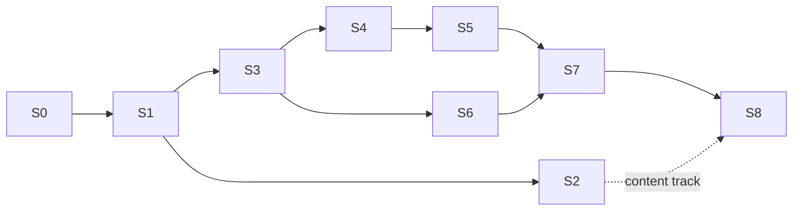

# Roadmap

- **Status:** Agreed with the maintainer on 2026-09-30
- **Date:** 2026-09-30
- **Reads with:** [`SPEC.md`](SPEC.md) says what the MVP is; this file says in what order it gets
  built. The board is <https://github.com/users/shoraLBRT/projects/3>.

**Work is taken from here.** Issues are the source of truth for what is done; this file holds what
an issue list cannot: the order, the dependencies, and what "done" means for each stage.

---

## How to use this plan

- **Two tracks run side by side.** The **engineering track** is stages 0–8, taken in order. The
  **content track** — the problem catalogue and the 20 tasks — is the maintainer's work with the
  authoring skills, and starts as soon as stage 2 delivers them. Content is the longest item in the
  MVP, so it must not wait for engineering to finish.
- **Take the lowest open stage.** Within a stage, take issues in the order listed unless the
  *Depends on* column allows otherwise. Work from a later stage starts only when nothing in an
  earlier one is unblocked.
- **A stage is done when its exit criterion has been shown to work** — run, clicked through, or
  tested — not when its issues are closed.
- **One issue per branch, one PR per issue**, as `AGENTS.md` requires. A partially done issue stays
  open with a comment saying exactly what is left.
- **Later iterations are not issues.** They live in [`SPEC.md`](SPEC.md) §12 and become issues when
  one is planned, so the board holds only what the MVP needs.

### Board conventions

| What | How |
| --- | --- |
| Stage | GitHub **milestone** `S0 …` to `S8 …` |
| MVP scope | label `phase:mvp` |
| Priority | label `priority:P0` (critical path), `P1` (needed for launch), `P2` (may slip past launch), mirrored in the board's Priority field |
| Kind of work | `type:feature`, `type:infra`, `type:docs`, `type:qa`, `type:security`, `type:tech-debt`, and new `type:content` |
| Area | `epic:*` — new: `cleanup`, `content`, `authoring`, `trainer`, `admin`, `public-site`, `measurement`, `deploy`; kept: `auth`, `progress`, `frontend`, `security`, `qa`, `docs`, `observability`, `ci-cd` |
| Size | the board's Size field, XS to XL, a relative estimate |

---

## Stages at a glance

| Stage | Goal | Exit criterion |
| --- | --- | --- |
| **S0 · Clear the ground** | Only code and documents of the new product remain | The solution builds and tests green with Workspaces, Evaluations, Submissions and Progress gone; the entry documents describe the new product |
| **S1 · Content foundation** | Content in files becomes content in the database and in the API | `content validate` runs in CI; ingest loads the reference content; `GET /tasks/{slug}` serves a task without its answer key; MinIO is gone |
| **S2 · Authoring** | The maintainer can produce cards and tasks with AI assistance | A card and a task made with the skills pass validation, and the task has passed a blind smoke test |
| **S3 · Trainer** | A learner can solve a task and read the review | Under the development identity: open the task catalogue, solve a task on desktop and at phone width, see the score and review |
| **S4 · Accounts** | Real people sign in | Sign in with GitHub and with Google; a signed-out learner presses *Check*, signs in, and lands on their review |
| **S5 · Progress, signals, admin** | The loop around a solved task | Progress shows by class and card; a signal sent from a review appears in the admin area; admin lists users and attempts |
| **S6 · Public site and measurement** | Found by search, measured | `/` and `/problems` are readable without JavaScript; Umami receives the listed events |
| **S7 · Production** | Running on the project's domain | One release command deploys to the VPS; TLS works; a backup has been restored once |
| **S8 · Launch** | The MVP as defined in SPEC §2.2 | All 20 tasks work publicly; the maintainer and two acquaintances have solved them; size bands and scoring are calibrated from their attempts |

---

## S0 · Clear the ground

Remove the previous product before building the new one, so that no session reads or extends code
that has no future. The last commit of the previous product is tagged `pre-diagnosis` first.

| Issue | Title | Depends on | Priority | Size |
| --- | --- | --- | --- | --- |
| [#119](https://github.com/shoraLBRT/ritocode/issues/119) | Remove the previous product's code | — | P0 | L |
| [#40](https://github.com/shoraLBRT/ritocode/issues/40) | Retire the previous product's documents and rewrite the entry documents | #119 | P0 | M |

- **#119** removes the Workspaces, Evaluations, Submissions and Progress modules with their tests,
  endpoints and cross-module contracts; `spikes/`; the frontend client calls for workspaces and
  submissions; `xp` and `trust_level` from Users. No production database exists, so development
  databases are recreated rather than migrated away. Object storage stays until S1, because the
  Problems ingest still writes to it.
- **#40** deletes the superseded documents and ADRs 0005, 0006 and 0009, fixes the references to
  them, rewrites `README.md`, `AGENTS.md`, `ARCHITECTURE.md` and `PROJECT_STATE.md` for the new
  product, trims `DOMAIN_MODEL.md` and `DATABASE_SCHEMA.md` to what exists after #119, and points
  the `session` skill at this file.

## S1 · Content foundation

| Issue | Title | Depends on | Priority | Size |
| --- | --- | --- | --- | --- |
| [#120](https://github.com/shoraLBRT/ritocode/issues/120) | Content format, taxonomy and `content validate` | S0 | P0 | L |
| [#121](https://github.com/shoraLBRT/ritocode/issues/121) | Ingest content into PostgreSQL and remove object storage | #120 | P0 | L |
| [#9](https://github.com/shoraLBRT/ritocode/issues/9) | Content read APIs: problem catalogue, treatment tree, task catalogue, task to solve | #121 | P0 | M |

- **#120** renames the Problems module to Content, replaces the old package format with the one in
  [`CONTENT_FORMAT.md`](CONTENT_FORMAT.md), commits the taxonomy files, adds a reference card, material
  and task that tests load, and adds a CI job that runs validation on every pull request.
- **#121** adds the content schema — cards, taxonomy, materials and their files, tasks, findings,
  shortlists, overviews, content revision — with upsert, unpublish and retire, and the development
  seeder. It removes MinIO, the storage client, the MinIO test harness and `STORAGE_LAYOUT.md`.
- **#9** serves [`SPEC.md`](SPEC.md) §9.3's four public reads. The answer key never leaves the server
  through them.

## S2 · Authoring

| Issue | Title | Depends on | Priority | Size |
| --- | --- | --- | --- | --- |
| [#122](https://github.com/shoraLBRT/ritocode/issues/122) | `author-card` skill | #120 | P0 | S |
| [#123](https://github.com/shoraLBRT/ritocode/issues/123) | `author-task` skill with the blind smoke test | #120 | P0 | M |
| [#124](https://github.com/shoraLBRT/ritocode/issues/124) | Write the problem catalogue: 55–60 cards | #122 | P0 | XL |
| [#42](https://github.com/shoraLBRT/ritocode/issues/42) | Write the 20 MVP tasks | #123, #124 in part | P0 | XL |

#124 and #42 are the **content track**. They stay open across stages, and each pull request adds a
batch. #42 needs only the cards its tasks use, not the whole catalogue.

## S3 · Trainer

Built under the existing development identity; real sign-in is S4.

| Issue | Title | Depends on | Priority | Size |
| --- | --- | --- | --- | --- |
| [#20](https://github.com/shoraLBRT/ritocode/issues/20) | Diagnosis scoring | #120 | P0 | S |
| [#125](https://github.com/shoraLBRT/ritocode/issues/125) | Attempts module: start, record step, submit, read, history | #9, #20 | P0 | L |
| [#26](https://github.com/shoraLBRT/ritocode/issues/26) | Frontend shell: translation catalogue, signed-in state, phone-width layout | S0 | P0 | M |
| [#27](https://github.com/shoraLBRT/ritocode/issues/27) | Task catalogue and problem catalogue pages | #9, #26 | P0 | M |
| [#126](https://github.com/shoraLBRT/ritocode/issues/126) | Task screen: material viewer, diagnosis and treatment | #9, #26, #125 | P0 | L |
| [#29](https://github.com/shoraLBRT/ritocode/issues/29) | Review screen | #126 | P0 | M |

- **#20** is a pure function with the worked example of [`SPEC.md`](SPEC.md) §5.3 as its first test.
- **#26** and **#27** can run in parallel with #20 and #125.

## S4 · Accounts

| Issue | Title | Depends on | Priority | Size |
| --- | --- | --- | --- | --- |
| [#6](https://github.com/shoraLBRT/ritocode/issues/6) | Sessions: cookie sign-in state, `/me`, sign-out, CSRF protection | S3 | P0 | M |
| [#7](https://github.com/shoraLBRT/ritocode/issues/7) | Sign-in with GitHub and Google, one account per verified e-mail | #6 | P0 | M |
| [#127](https://github.com/shoraLBRT/ritocode/issues/127) | Signed-out solving: sign in on *Check* and return to the task | #7, #126 | P0 | M |
| [#128](https://github.com/shoraLBRT/ritocode/issues/128) | Privacy policy page and sign-in notice | #26 | P0 | XS |

OAuth apps can be registered against `localhost` for development, so S4 does not wait for the
domain. #128 needs the policy text from the maintainer (#134).

## S5 · Progress, signals, admin

| Issue | Title | Depends on | Priority | Size |
| --- | --- | --- | --- | --- |
| [#24](https://github.com/shoraLBRT/ritocode/issues/24) | Progress by classes and cards | #125 | P1 | M |
| [#30](https://github.com/shoraLBRT/ritocode/issues/30) | Progress page | #24, #26 | P1 | S |
| [#129](https://github.com/shoraLBRT/ritocode/issues/129) | Signals: "I'm sure it is here" | #125, #29 | P1 | S |
| [#130](https://github.com/shoraLBRT/ritocode/issues/130) | Admin area: signals, users and attempts | #129, #7 | P1 | M |
| [#35](https://github.com/shoraLBRT/ritocode/issues/35) | Security baseline for the new product | #125, #7, #130 | P0 | M |

## S6 · Public site and measurement

| Issue | Title | Depends on | Priority | Size |
| --- | --- | --- | --- | --- |
| [#131](https://github.com/shoraLBRT/ritocode/issues/131) | Landing page | #26 | P1 | S |
| [#132](https://github.com/shoraLBRT/ritocode/issues/132) | Prerender `/` and `/problems` for search engines | #27, #131 | P1 | M |
| [#133](https://github.com/shoraLBRT/ritocode/issues/133) | Umami analytics and product events | #126, #127 | P1 | S |

## S7 · Production

| Issue | Title | Depends on | Priority | Size |
| --- | --- | --- | --- | --- |
| [#134](https://github.com/shoraLBRT/ritocode/issues/134) | Launch prerequisites (maintainer): domain, VPS in Russia, OAuth apps, privacy text | — | P0 | S |
| [#31](https://github.com/shoraLBRT/ritocode/issues/31) | CI: release images | S0 | P0 | M |
| [#135](https://github.com/shoraLBRT/ritocode/issues/135) | Production deployment on a VPS in Russia | #134, #31 | P0 | L |
| [#136](https://github.com/shoraLBRT/ritocode/issues/136) | Release command and backups | #135 | P0 | M |
| [#33](https://github.com/shoraLBRT/ritocode/issues/33) | Structured logging and request correlation | S0 | P1 | S |
| [#34](https://github.com/shoraLBRT/ritocode/issues/34) | Minimal monitoring: health checks and an uptime alert | #135 | P2 | S |
| [#41](https://github.com/shoraLBRT/ritocode/issues/41) | Operational runbook and release checklist | #136 | P1 | S |

**#134 is the maintainer's, and it can start today.** Registering a domain, renting a VPS and
creating OAuth apps take calendar time rather than effort, and nothing else in S7 can finish
without them.

## S8 · Launch

| Issue | Title | Depends on | Priority | Size |
| --- | --- | --- | --- | --- |
| [#39](https://github.com/shoraLBRT/ritocode/issues/39) | End-to-end test of the learning flow | S5 | P1 | M |
| [#137](https://github.com/shoraLBRT/ritocode/issues/137) | Trial with three people, and calibration | S7, #124, #42 | P0 | M |

#137 is the launch criterion itself: the maintainer and two acquaintances solve the 20 tasks on
the production site, and the journal of their attempts is used to correct the size bands and the
scoring parameters in [`SPEC.md`](SPEC.md).
